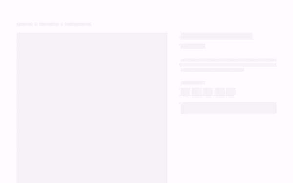
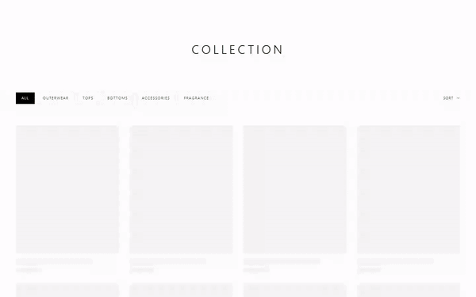
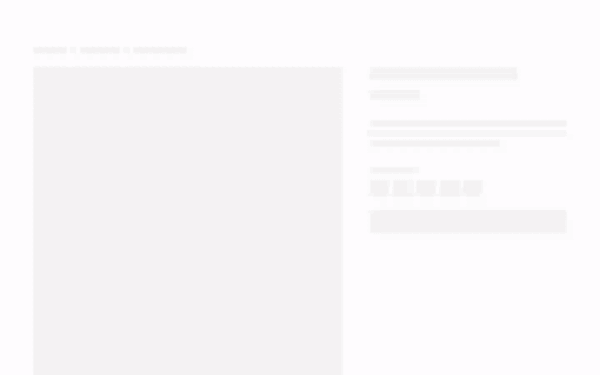
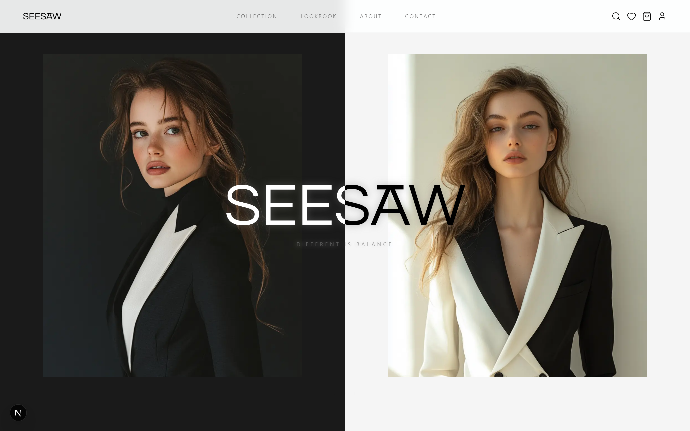
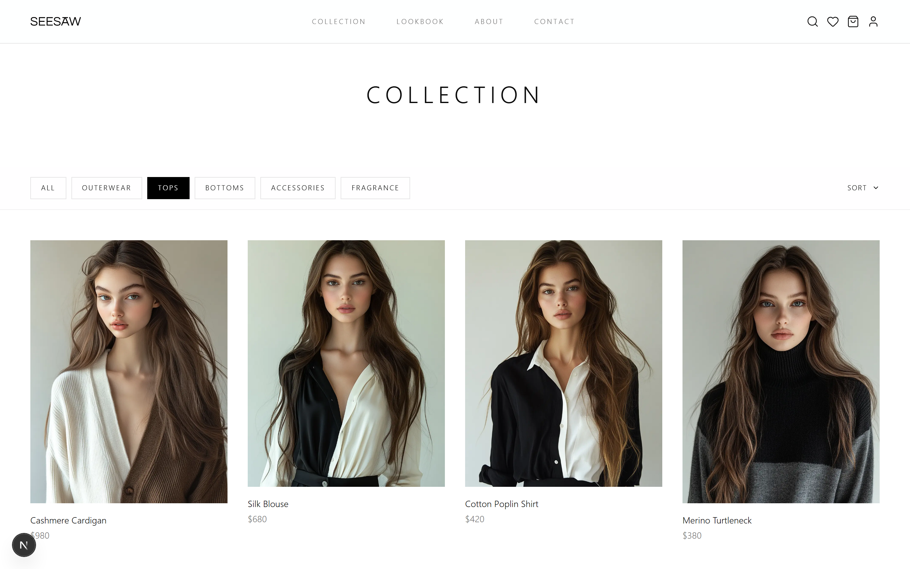
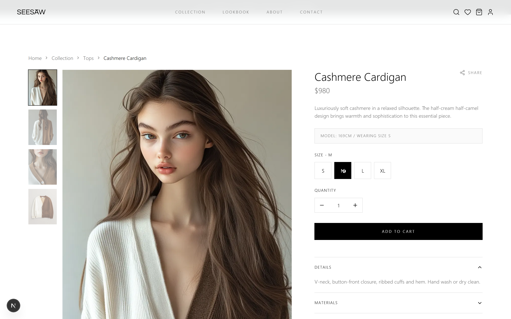
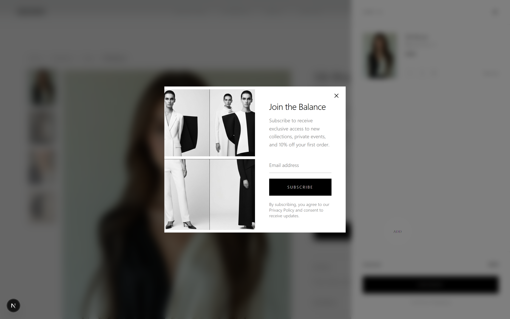
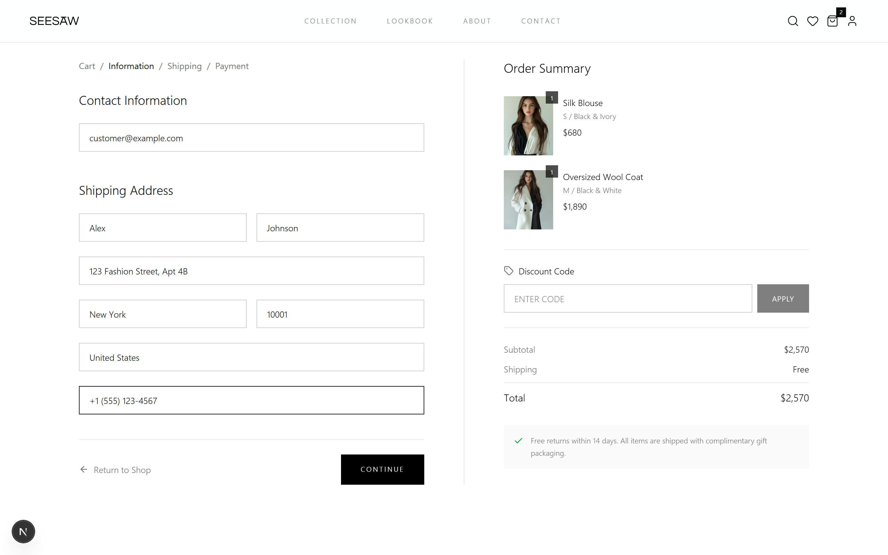
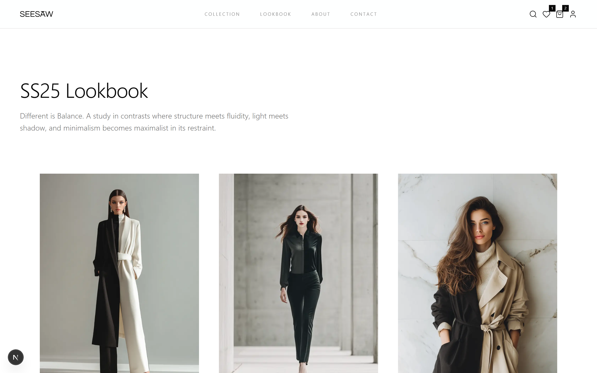

  

<h1 align="center">SEESAW</h1>

  <strong>Premium Fashion E-Commerce Platform</strong>

  미니멀하고 세련된 디자인의 프리미엄 패션 이커머스 플랫폼

  <a href="#features">Features</a> •
  <a href="#demo">Demo</a> •
  <a href="#tech-stack">Tech Stack</a> •
  <a href="#getting-started">Getting Started</a>

---

## ✨ Features

- 🛒 **장바구니 & 위시리스트** - 사이드바 장바구니와 위시리스트 기능
- 🔍 **실시간 검색** - 모달 기반 빠른 상품 검색
- 👁️ **퀵뷰** - 상품 상세 페이지 이동 없이 빠르게 확인
- 🖼️ **상품 갤러리** - 드래그 & 줌 기능이 포함된 상품 이미지 갤러리
- 🎨 **다크 & 라이트 테마** - 미니멀한 디자인 시스템
- 📱 **반응형 디자인** - 모바일, 태블릿, 데스크톱 완벽 지원
- 🔐 **인증 시스템** - Supabase 기반 로그인/회원가입
- 💳 **결제 시스템** - Stripe 연동 결제 프로세스

---

## 🎬 Demo

### 🏠 Hero Animation

  

### 🛍️ Add to Cart

  

### 🔍 Product Search

  

### ❤️ Wishlist

  

### 👁️ Quick View

  

### 📸 Product Gallery

  

---

## 📸 Screenshots

<table>
  <tr>
    <td align="center"><strong>Home</strong></td>
    <td align="center"><strong>Collection</strong></td>
  </tr>
  <tr>
    <td></td>
    <td></td>
  </tr>
  <tr>
    <td align="center"><strong>Product Detail</strong></td>
    <td align="center"><strong>Cart Sidebar</strong></td>
  </tr>
  <tr>
    <td></td>
    <td></td>
  </tr>
  <tr>
    <td align="center"><strong>Checkout</strong></td>
    <td align="center"><strong>Lookbook</strong></td>
  </tr>
  <tr>
    <td></td>
    <td></td>
  </tr>
</table>

---

## 🛠️ Tech Stack

| Category | Technologies |
|----------|-------------|
| **Framework** | Next.js 15 (App Router) |
| **Language** | TypeScript |
| **Styling** | Tailwind CSS |
| **Animation** | Framer Motion |
| **Authentication** | Supabase Auth |
| **Database** | Supabase (PostgreSQL) |
| **Payment** | Stripe |
| **State Management** | React Context + TanStack Query |
| **Icons** | Lucide React |
